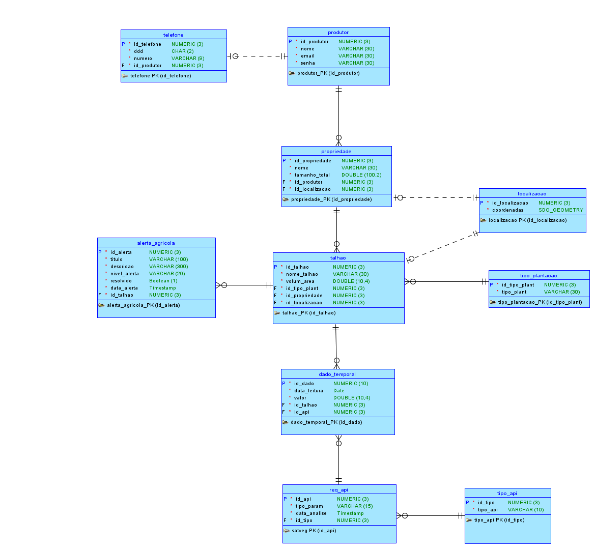
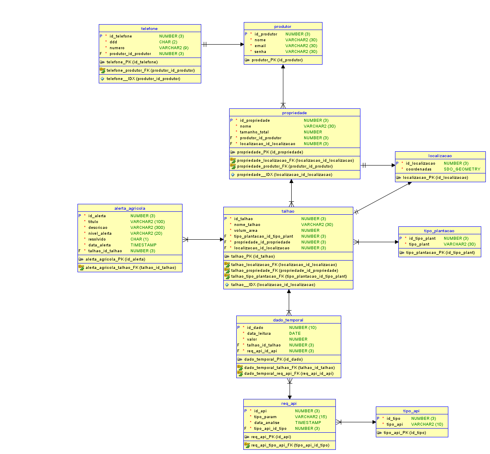

# Terra Nova Database

> Global Solution FIAP - Mastering Relational and Non-Relational Database

Sistema de banco de dados desenvolvido para suporte à plataforma **Terra Nova**, responsável pelo armazenamento, processamento e análise de informações agrícolas obtidas a partir de integrações com a NASA POWER e a Embrapa SATVeg.

---

## Links da Entrega

| Recurso               | Link                  |
| --------------------- | --------------------- |
| Repositório GitHub    | [Database-Advanced](https://github.com/Global-Solution-Space/Database-Advanced)         |
| Modelo Lógico         | `docs/Logical.png`    |
| Modelo Relacional     | `docs/Relational.png` |

---

## Integrantes

| Nome                       |     RM | Turma  | GitHub           |
| -------------------------- | -----: | ------ | ---------------- |
| Enzo Okuizumi              | 561432 | 2TDSPG | EnzoOkuizumiFiap |
| Lucas Barros Gouveia       | 566422 | 2TDSPG | LuzBGouveia      |
| Milton Marcelino           | 564836 | 2TDSPG | MiltonMarcelino  |
| Luna de Carvalho Guimarães | 562290 | 2TDSPG | lunaguima        |
| Gustavo Okada              | 563428 | 2TDSPG | Gdev3356         |

---

## Problema

Produtores rurais enfrentam dificuldades para monitorar grandes áreas agrícolas e identificar rapidamente situações de risco relacionadas à vegetação, precipitação e produtividade.

A ausência de acompanhamento contínuo pode resultar em perdas econômicas, desperdício de recursos e atraso na tomada de decisões.

---

## Solução Proposta

O Terra Nova utiliza informações provenientes de APIs externas para monitorar talhões agrícolas e gerar alertas que auxiliam o produtor rural.

O banco de dados foi projetado para:

* Armazenar produtores e propriedades rurais;
* Gerenciar talhões e suas localizações;
* Registrar requisições realizadas às APIs externas;
* Persistir séries temporais de índices vegetativos e climáticos;
* Gerar e acompanhar alertas agrícolas;
* Fornecer relatórios para apoio à tomada de decisão.

---

## Modelagem de Dados

### Entidades Principais

* Produtor
* Telefone
* Localização
* Propriedade
* Talhão
* Tipo de Plantação
* Tipo de API
* Requisição de API
* Dado Temporal
* Alerta Agrícola

### Modelo Lógico



### Modelo Relacional



---

## Estrutura do Repositório

```
.
├── defaultdomains.xml
│
├── docs/
│   ├── Logical.png
│   └── Relational.png
│
├── fazenda/
│   ├── businessinfo/
│   │   └── Business Information.xml
│   │
│   ├── datatypes/
│   │   ├── DataTypes.xml
│   │   ├── structuredtype/
│   │   └── subviews/
│   │
│   ├── logical/
│   │   ├── entity/
│   │   ├── relation/
│   │   ├── Logical.xml
│   │   └── subviews/
│   │
│   ├── mapping/
│   │   └── Arquivos de mapeamento gerados pelo Oracle SQL Developer Data Modeler
│   │
│   ├── pm/
│   │   └── Process Model.xml
│   │
│   ├── rdbms/
│   │   └── fazenda_RDBMSSites.xml
│   │
│   └── rel/
│       └── Estruturas relacionais geradas pelo Oracle SQL Developer Data Modeler
│
├── fazenda.dmd
├── fazenda.ddl
│
├── scripts/
│   ├── blocos_anonimos/
│   │   ├── bloco01_consulta_produtor.sql
│   │   ├── bloco02_classifica_alertas.sql
│   │   ├── bloco03_for_loop.sql
│   │   ├── bloco04_while_loop.sql
│   │   ├── bloco05_loop_exit_when.sql
│   │   └── bloco06_insert_tipo.sql
│   │
│   ├── functions/
│   │   ├── fn_media_leituras.sql
│   │   └── fn_total_alertas.sql
│   │
│   ├── procedures/
│   │   ├── pr_gerar_alerta.sql
│   │   └── pr_resolver_alerta.sql
│   │
│   ├── relatorios/
│   │   ├── relatorio01_produtor_propriedade.sql
│   │   ├── relatorio02_propriedade_talhao.sql
│   │   ├── relatorio03_alertas.sql
│   │   ├── relatorio04_dados_api.sql
│   │   └── relatorio05_plantacoes.sql
│   │
│   └── triggers/
│       ├── trg_valida_area.sql
│       └── trg_valida_resolvido.sql
│
└── README.md
```

---

## Tecnologias Utilizadas

| Tecnologia                        | Uso                                                    |
| --------------------------------- | ------------------------------------------------------ |
| Oracle Database 21c               | Sistema Gerenciador de Banco de Dados                  |
| Oracle SQL Developer              | Execução e testes dos scripts SQL e PL/SQL             |
| Oracle SQL Developer Data Modeler | Modelagem lógica e relacional do banco de dados        |
| SQL                               | Definição e manipulação dos dados                      |
| PL/SQL                            | Procedures, Functions, Triggers e Blocos Anônimos      |

---

## Recursos Implementados

### Procedures

#### pr_gerar_alerta

Realiza a criação automática de alertas agrícolas para um determinado talhão, classificando o nível do alerta com base no valor informado.

#### pr_resolver_alerta

Marca um alerta agrícola como resolvido.

---

### Functions

#### fn_total_alertas

Retorna a quantidade total de alertas associados a um talhão.

#### fn_media_leituras

Retorna a média dos valores registrados nos dados temporais de um talhão.

---

### Blocos Anônimos

Foram desenvolvidos blocos demonstrando:

* Consulta utilizando SELECT INTO;
* Estruturas condicionais IF / ELSIF / ELSE;
* Estrutura FOR LOOP;
* Estrutura WHILE LOOP;
* Estrutura LOOP EXIT WHEN;
* Manipulação de variáveis e persistência em tabelas.

---

### Relatórios

#### Relatório de Produtores e Propriedades

Relaciona produtores às suas propriedades rurais.

#### Relatório de Propriedades e Talhões

Apresenta os talhões pertencentes a cada propriedade.

#### Relatório de Alertas

Exibe os alertas agrícolas registrados para cada talhão.

#### Relatório de Dados Temporais

Relaciona leituras temporais às requisições de API responsáveis por sua geração.

#### Relatório de Plantação

Apresenta os tipos de plantação associados aos talhões.

---

### Triggers

#### trg_valida_area

Valida a área informada para um talhão, impedindo registros com valores inválidos.

#### trg_valida_resolvido

Garante a consistência das informações quando um alerta é marcado como resolvido.

---

## Como Executar

### 1. Criar a estrutura do banco

```sql
@fazenda.ddl
```

### 2. Executar Procedures

```sql
@scripts/procedures/pr_gerar_alerta.sql
@scripts/procedures/pr_resolver_alerta.sql
```

### 3. Executar Functions

```sql
@scripts/functions/fn_total_alertas.sql
@scripts/functions/fn_media_leituras.sql
```

### 4. Executar Triggers

```sql
@scripts/triggers/trg_valida_area.sql
@scripts/triggers/trg_valida_resolvido.sql
```

### 5. Executar os Blocos Anônimos

Executar todos os scripts da pasta:

```text
scripts/blocos_anonimos/
```

### 6. Executar os Relatórios

Executar todos os scripts da pasta:

```text
scripts/relatorios/
```

---

## Exemplos de Teste

### Gerar alerta

```sql
EXEC pr_gerar_alerta(1, 15);
```

### Resolver alerta

```sql
EXEC pr_resolver_alerta(1);
```

### Consultar total de alertas

```sql
SELECT fn_total_alertas(1)
FROM dual;
```

### Consultar média de leituras

```sql
SELECT fn_media_leituras(1)
FROM dual;
```

---

## Disciplina

**Mastering Relational and Non-Relational Database**

Global Solution 2026/1 - FIAP
